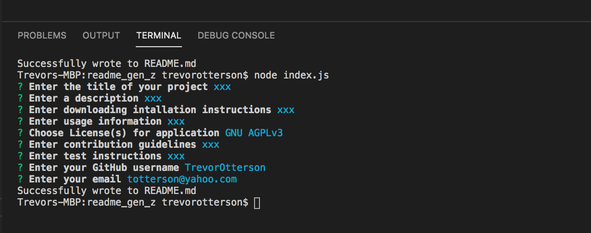

#README.md Gen Z I created a node.js process to walk a user through creating a README file. The file includes a title, description, instructions, etc. to be fully filled out and professional.

I ran into issues of changing design, but resolved it with the markdown websites as guides. I enjoyed learning about a new way to use js and was able to create a working model that does what I planned.

To initiate document you must type node index.js into the terminal, Then follow the prompts to create your readme. 

Below is what it looks like in the terminal, and a link to a tutorial video I made of how to use the application.

<a>https://drive.google.com/file/d/11UnXpOwwWy5WzlXcy1PoWp2g7tn0Zu4Y/view</a>